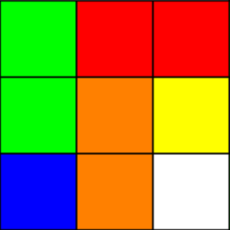

# Github

[Ссылка на MD файл](https://github.com/alice768/Company/commit/86f0b9c6d7c2e4cb03d3726be7b93bb568ad7184 "Подсказка")
  
  Git — это система управления версиями, которая пришлась по душе практически всем — от разработчиков до дизайнеров. GitHub можно считать соцсетью для хранения кода. Здесь вы можете попрактиковаться в разработке и придумать что-то свое, найти множество open-source проектов, передовых технологий, различных функций и дизайнов.
  ***
  Пример кода в Github:

```
a = 5; 
b = 3; 
c = a + b; 
``` 
## Списки
  
  Markdown поддерживает упорядоченные (нумерованные) и неупорядоченные (ненумерованные) списки. Для формирования неупорядоченный списков используются такие маркеры, как звездочки, плюсы и дефисы. Все перечисленные маркеры могут использоваться взаимозаменяемо.
    
    Для формирования упорядоченных списков в качестве маркеров используются числа с точкой. Важной особенностью в данном случае является то, что сами номера, с помощью которых формируется список, не важны, так как они не оказывают влияния на выходной HTML код.
      
      Пример списка:
     
Второ́е нача́ло термодина́мики (второй закон термодинамики) устанавливает существование энтропии как функции состояния термодинамической системы и вводит понятие абсолютной термодинамической температуры, то есть «второе начало представляет собой закон об энтропии» и её свойствах. 
Текст 1 
********* 
Текст 2 
====

# Изолированная система
В изолированной системе энтропия либо остаётся неизменной, либо возрастает (в неравновесных процессах), достигая максимума при установлении термодинамического равновесия (закон возрастания энтропии). 
1. Номер 1 
2. Номер 2 
3. Номер 3


Встречающиеся в литературе различные формулировки второго начала термодинамики являются частными следствиями закона возрастания энтропии.
>цитата



